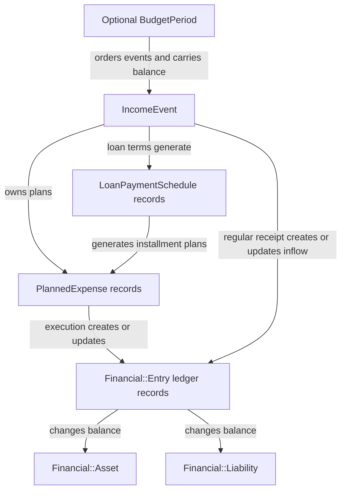

# Income Events: Current Technical Reference

This document describes the `IncomeEvent` feature as it is currently implemented. It is intended to be usable as standalone context for technical analysis, including analysis by an AI that does not have access to the repository. It describes current behavior, not a proposed or ideal design.

## Purpose and mental model

An `IncomeEvent` represents money that is expected to become available at a particular time. Examples include salary, freelance income, and loan proceeds. It is both:

- a planning container for deciding how incoming money will be used; and
- an origin reference for the accounting entries created when money is received or plans are executed.

The record stores expected and actual receipt information, optionally belongs to a budget period, and owns planned transactions. When it belongs to a budget period, unused funds or deficits are carried through that period's chronological sequence of income events.

There are two modes:

- **Regular income** records an ordinary inflow to either an asset account or a liability account.
- **Loan income** records borrowed money, its destination, the originating liability, repayment terms, an amortization schedule, and generated repayment plans.

`Financial::Entry` is the canonical accounting record for movements of money. `IncomeEvent` and `PlannedExpense` are planning/origin records; they are not themselves ledger entries.

## Data flow



## Stored data

### Common fields

| Field | Meaning and current rules |
| --- | --- |
| `account_id` | Required owning account. Set from `Current.account` on creation when not assigned explicitly. |
| `budget_period_id` | Optional budget period. Balance carryover is disabled when this is absent. |
| `description` | Required human-readable name. |
| `expected_date` | Required expected receipt date. Also serves as the loan start date. |
| `expected_amount` | Required positive amount. For loans it is synchronized from `loan_amount` during validation. |
| `received_date` | Optional actual receipt date. Its presence, rather than status, is what `is_received?` checks. |
| `received_amount` | Optional actual amount. Calculations fall back to `expected_amount` when absent. |
| `status` | Required: `pending`, `received`, or `applied`. Defaults to `pending`. |
| `income_type` | Required: `regular` or `loan`. Defaults to `regular`. |

### Regular-income routing

A regular event may point to exactly one of these destinations:

| Field | Accounting effect |
| --- | --- |
| `regular_income_destination_asset_id` | Credits a `Financial::Asset` through an `inflow` entry. |
| `regular_income_destination_liability_id` | Reduces a `Financial::Liability` through an `inflow` entry whose counterparty is that liability. |

The form exposes these through the virtual `destination_selection` value, encoded as `asset:<id>` or `liability:<id>`. If either destination field is set, validation requires exactly one destination and requires it to belong to the same account. A regular event with neither destination is currently valid.

### Loan fields

| Field | Meaning and current rules |
| --- | --- |
| `loan_amount` | Required and positive for loans; also becomes `expected_amount`. |
| `loan_liability_id` | Required originating liability that represents the new debt. |
| `loan_disbursement_destination_asset_id` | Optional asset destination for proceeds. |
| `loan_disbursement_destination_liability_id` | Optional liability destination for proceeds, used when borrowed money directly pays another debt. |
| `interest_rate` | Optional non-negative annual nominal percentage with three decimal places. |
| `interest_rate_estimated` | Indicates that the saved rate was inferred from payment terms. |
| `number_of_payments` | Required positive integer. |
| `payment_frequency` | Required: `weekly`, `biweekly`, `quincenal`, or `monthly`. Legacy `quicenal` input is normalized to `quincenal`. |
| `payment_amount` | Optional positive installment amount. Either this or `interest_rate` must be supplied. |
| `lender_name` | Optional descriptive lender name. |
| `notes` | Optional free-form loan notes. |

A loan requires one originating liability and exactly one disbursement destination. All selected financial records must belong to the income event's account. During validation, `loan_amount` defaults from `expected_amount`, `expected_date` defaults to the current date, and `received_amount` defaults to the loan amount even if the loan is still pending. The selected terms are invalid when `payment_amount * number_of_payments` is less than the principal.

## Associations and ownership

An income event:

- belongs to one `Account`;
- optionally belongs to one `BudgetPeriod`;
- optionally references regular-income and loan routing accounts;
- has many `PlannedExpense` records that are paid from this event;
- may be the `origin_income_event` of generated loan-installment plans;
- has many legacy `Expense` records and canonical `Financial::Entry` records;
- has many `LoanPaymentSchedule` records when it is a loan;
- exposes one regular inflow entry and one loan-disbursement entry through filtered associations.

Controller lookups use `IncomeEvent.for_account(Current.account)`, and financial routing validation rejects records belonging to another account. Budget-period lookups are also scoped to `Current.account` when a nested budget-period route is used.

On deletion, owned planned expenses and loan-payment schedules are configured to be destroyed. Plans that only reference the event as their origin are retained with `origin_income_event_id` cleared. Legacy expenses and financial entries are configured to be retained with `income_event_id` cleared. A separate regular-income callback attempts to remove its automatically synchronized inflow; see the deletion caveat below.

## Status and lifecycle

The status values are strings, not a formal state machine. The edit form permits any status to be selected directly.

| Status | Intended meaning | Automatic accounting behavior |
| --- | --- | --- |
| `pending` | Income is expected but not yet received. | A regular inflow is removed or not created. Loan schedules and repayment plans still exist. |
| `received` | Actual receipt date and amount have been recorded. | A routed regular event has one synchronized `inflow`. Receiving a loan creates or updates its `loan_disbursement` entry. |
| `applied` | Plans have been executed, or a loan disbursement has been applied. | A regular inflow remains synchronized. A loan disbursement remains synchronized. |

### Regular-income lifecycle

1. **Create or edit:** Save the expected details, optional budget period, optional destination, and plans.
2. **Plan:** Add expense plans, transfers, or liability payments under the event. Planning does not require the income to have been received.
3. **Receive:** The `receive` action saves `received_date`, `received_amount`, and status `received`.
4. **Synchronize inflow:** After every commit, a regular event in `received` or `applied` status with a destination creates or updates one `Financial::Entry` of type `inflow`. The entry uses the received date/amount when present and otherwise the expected date/amount. Returning the event to `pending`, or removing its destination, deletes that synchronized inflow.
5. **Apply all:** For each plan not already in a final status (`paid`, `transferred`, or `spent`), `PlannedExpenses::ExecuteService` creates or updates its financial entry and assigns a final status. The income event is then marked `applied`.

Applying plans produces different entry types based on routing:

| Planned transaction | Resulting `Financial::Entry` type | Budget treatment |
| --- | --- | --- |
| Ordinary asset-funded expense | `outflow` | Consumes the income-event budget. |
| Charge assigned to a liability | `liability_charge` | Consumes the income-event budget. |
| Asset-to-asset movement | `transfer` | Budget-neutral. |
| Asset-to-liability payment | `liability_payment` | Budget-neutral. |

### Loan lifecycle

1. **Create or edit terms:** Every committed loan save regenerates its unpaid amortization rows, preserving schedule rows already marked `paid`.
2. **Synchronize repayment plans:** Active schedule rows are mirrored to installment `PlannedExpense` records by installment number. Generated plans use the first category in the account, reference the loan as both their current income event and origin event, and use the loan destination asset and origin liability as routing when applicable. Finalized plans are not reset when terms change.
3. **Receive:** The receive action records actual receipt fields, changes status to `received`, and explicitly creates or updates a `loan_disbursement` entry.
4. **Apply:** `Loans::ApplyService` creates or updates the same disbursement entry and changes the event to `applied`. Repeated application is idempotent with respect to that entry.
5. **Reconcile:** Later changes to an applied loan regenerate schedules/plans and update the disbursement entry through after-commit synchronization.

A loan disbursement increases its destination asset when an asset is selected, or reduces its destination liability when a liability is selected. At the same time it increases the originating loan liability.

### Automatically generated records

| Source and trigger | Generated or synchronized record | Idempotency key/current matching rule |
| --- | --- | --- |
| Routed regular event in `received` or `applied` status | `Financial::Entry` with type `inflow` | Income event, entry type, and absence of expense/planned-expense links. |
| Saving a loan | `LoanPaymentSchedule` rows | Unpaid rows are regenerated; paid rows are preserved. |
| Saving a loan when the account has a category | Installment `PlannedExpense` rows | Loan plus installment number. |
| Receiving or applying a loan | `Financial::Entry` with type `loan_disbursement` | Income event plus entry type. |
| Applying a planned transaction | Entry determined by financial routing | Existing entry linked to the planned expense. |

## Calculations

### Regular income

For regular events, the income amount used by budget calculations is:

```text
income amount = received_amount when present, otherwise expected_amount
```

`total_planned` includes:

- all budget-consuming planned expenses, including already executed plans; and
- direct financial entries linked to the event, without a planned-expense link, whose type is `outflow` or `liability_charge`.

Entries created from a plan are excluded from the second term to avoid counting both the plan and its execution. Transfers and asset-to-liability payments are treated as movements and do not consume the budget.

`total_spent` is the sum of all linked `outflow` and `liability_charge` entries, whether direct or generated from a plan.

```text
remaining_budget = income amount - total_planned
```

This means `remaining_budget` describes how much is not yet allocated, rather than actual cash remaining after spending.

### Carryover between events

Carryover is calculated only among events in the same budget period. An event without a budget period has no previous event and a previous balance of zero.

Each event is ordered by its **effective date**:

```text
effective date = received_date when present, otherwise expected_date
```

When effective dates are equal, the lower database ID comes first. The immediately preceding event supplies its complete cumulative balance:

```text
previous_balance = previous_event.effective_remaining_budget
effective_remaining_budget = remaining_budget + previous_balance
```

Both surpluses and deficits therefore carry forward. The recursion stops at the first event in the budget period.

### Loan calculations

Loan events replace the regular definitions of planned and spent totals:

```text
loan total planned = sum of all active schedule installment amounts
loan total spent   = sum of all paid schedule installment amounts
remaining budget   = received/expected loan amount - loan total planned
```

The loan summary also exposes:

```text
loan total repayment = sum of all active schedule installment amounts
loan total paid      = sum of full installment amounts marked paid
loan remaining balance = loan principal - loan total paid
```

The schedule uses a standard fixed-payment amortization formula. Annual rates are divided by periods per year: 52 for weekly, 26 for biweekly, approximately 24.33 for 15-day `quincenal`, and 12 for monthly. Due dates begin one payment interval after `expected_date`.

If the user provides an interest rate, the browser calculates a payment estimate and the server uses the rate to generate the schedule. If the user provides a payment amount without a rate, both browser and server solve for a periodic rate by binary search and annualize it. The stored inferred annual rate is rounded to three decimal places. Server-side calculations remain authoritative.

## Routes and user interface

The feature is exposed through top-level `/income_events` routes and nested `/budget_periods/:budget_period_id/income_events` routes.

Important member actions are:

| Route action | Method | Behavior |
| --- | --- | --- |
| `receive` | `GET` | Shows the actual receipt form, defaulting to today's date and expected amount. |
| `receive` | `PATCH` | Saves actual receipt information and performs receipt synchronization. |
| `apply_all` | `POST` | Applies all eligible regular plans or applies a loan disbursement. |
| `loan_summary` | `GET` | Shows loan terms, schedule, balances, and installment checklist. |
| `pay_liability` | `POST` | Records a payment from a selected asset to a liability, linked to this income event. |

Nested planned-expense routes support creating, editing, deleting, moving, applying, and explicitly creating transactions. Nested direct-expense routes create unplanned outflow or liability-charge entries linked to the event.

### Index

The unscoped index lists events for `Current.account`; a nested index lists events for one account-owned budget period. Events are ordered by expected date descending, grouped by expected-date month, and may be filtered with a parseable `month` parameter. Summary cards display expected totals, pending count, received/applied count, planning progress, previous balance, and effective remaining balance.

### Create and edit form

The form captures common details, destination, status, and optional budget period. Selecting the loan type reveals loan terms and hides the regular expected-amount field. A Stimulus controller keeps payment and annual-interest estimates synchronized in the browser, while model validation repeats the important financial checks on the server.

### Detail page

The detail page displays income amount, previous balance, total planned, total spent, and effective remaining budget. Planned transactions are separated into budget-consuming expenses and budget-neutral movements. It also exposes:

- receive, apply, edit, delete, plan, and loan-summary actions as applicable;
- direct financial entries without a linked plan;
- active liabilities that can be paid from a selected asset and linked to the event; and
- the loan schedule on loan events.

The “Mark as Received” button is controlled by the presence of `received_date`. The “Apply All” button is shown only when a receipt date exists and status is not `applied`.

## Current caveats and surprising behavior

These are observations about the present implementation, not requirements for a future design.

1. **Status and receipt fields are independent.** The edit form permits direct status changes, and the model does not require `received_date` for `received` or `applied`. UI action visibility uses `received_date`, while transaction synchronization uses status. Consequently, the two representations can disagree.

2. **A regular destination is optional until one is set.** A received or applied regular event without a destination remains valid but creates no inflow entry. Once either destination field is populated, validation requires exactly one.

3. **Carryover has budget-period boundaries.** Events without a budget period do not participate, and balances do not cross from one period to another even when the dates are consecutive.

4. **Carryover is computed in Ruby.** Finding a previous event loads all other events in the budget period, and cumulative balance calls recurse through previous events. This is straightforward but may become expensive with long event histories.

5. **Expected-date and effective-date ordering differ.** The index groups and sorts on `expected_date`; carryover ordering prefers `received_date`. The visible sequence may therefore differ from the sequence used for balance propagation.

6. **Loan schedules and installment plans have separate statuses.** The loan sync creates both, but executing or finalizing a generated `PlannedExpense` does not currently mark the matching `LoanPaymentSchedule` as paid. Schedule-based loan totals may therefore disagree with executed accounting entries.

7. **Generated repayment plans depend on an existing category.** If the account has no category, the loan schedule is generated but installment planned expenses are not.

8. **Loan budget metrics use repayment totals.** `total_planned` is the full active repayment schedule, including interest, rather than planned uses of the loan proceeds. As a result, a loan's `remaining_budget` is commonly negative by the amount of interest and participates in carryover if the loan belongs to a budget period.

9. **The displayed loan remaining balance subtracts whole payments from principal.** It does not sum the schedule's `principal_amount`, so interest included in paid installments also reduces the displayed balance.

10. **Legacy and canonical expense representations coexist.** Monetary totals and direct-expense lists use `Financial::Entry`, but at least one detail-page count still reads the legacy `expenses` association. Counts can therefore differ from the entries used in totals.

11. **Deletion semantics are mixed.** Financial entries are declared `dependent: :nullify`, while the regular-income destroy callback separately tries to remove its synchronized inflow after commit. Consumers should not assume all event-linked accounting entries are deleted with the event; the declared retention behavior is to clear their `income_event_id`.

12. **Loan synchronization is commit-driven.** Every committed loan change can regenerate unpaid schedules and installment plans. Editing routing or terms can therefore change several associated records even when the user did not explicitly request schedule regeneration.

13. **Budget-period selection is broader than controller lookup scoping.** The form currently builds its budget-period selector from all `BudgetPeriod` records, while the nested controller lookup is account-scoped. The model does not independently validate that the selected budget period belongs to the same account.

## Implementation map and verification baseline

The behavior described here is primarily implemented in:

- `IncomeEvent` for validation, calculations, carryover, and commit callbacks;
- `IncomeEventsController` for CRUD, receipt, application, liability payment, and page data;
- `IncomeEvents::TransactionSyncService` for regular inflows;
- `Loans::ScheduleGenerator`, `Loans::PlannedExpenseSyncService`, `Loans::DisbursementSyncService`, and `Loans::ApplyService` for loan behavior;
- `PlannedExpenses::ExecuteService` for turning plans into financial entries; and
- the income-event forms, cards, detail page, and loan summary for presentation behavior.

At the time this reference was written, the focused `IncomeEvent` model, controller, and loan-application test files passed with **24 tests, 123 assertions, 0 failures, and 0 errors**. This is a verification baseline, not a claim that every caveat above has dedicated test coverage.
